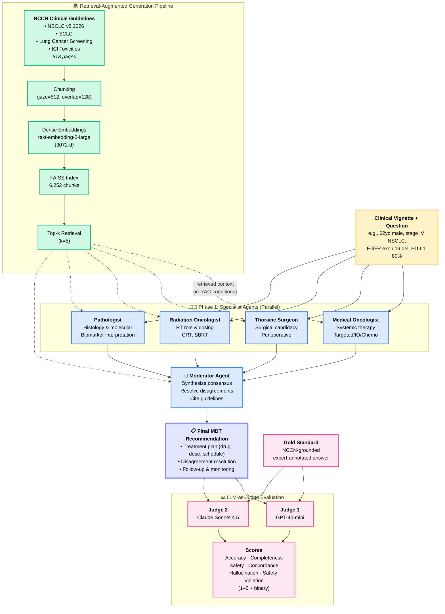
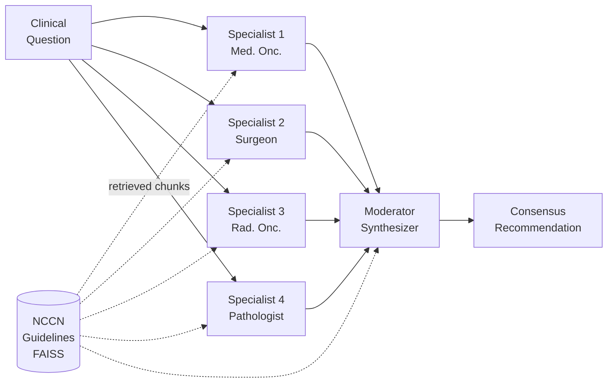

# Figure 1: MDT-LLM Architecture

## Primary architecture diagram (Mermaid)



---

## Alternative simpler version (for publication)



---

## How to render for the paper

### Option 1: Export high-res PNG/SVG from Mermaid Live Editor
1. Go to https://mermaid.live
2. Paste the Mermaid code above
3. Click "Actions" → "Download as SVG" (or PNG for 2x)
4. For JKSUCIS submission, export as **SVG** (vector, lossless)

### Option 2: Rebuild in draw.io / Figma for publication quality
- Import the Mermaid SVG, clean up arrows and typography
- Keep the layout but use JKSUCIS-compatible fonts (Times / Helvetica)

### Option 3: TikZ (LaTeX-native)
```latex
\usepackage{tikz}
\usetikzlibrary{shapes,arrows,positioning,fit}
% ... (can provide TikZ code on request)
```

---

## Caption for Figure 1

> **Figure 1.** Architecture of the MDT-LLM framework. A clinical vignette and question are presented in parallel to four role-conditioned specialist agents (medical oncologist, thoracic surgeon, radiation oncologist, pathologist), each instantiated with a distinct system prompt. Their individual opinions are synthesized by a moderator agent into a consensus recommendation. When retrieval-augmented generation (RAG) is enabled, relevant chunks from the NCCN clinical guidelines (indexed in FAISS) are retrieved via dense embeddings and injected into the context of each agent. The final output is evaluated by two independent LLM judges (GPT-4o-mini, Claude Sonnet 4.5) against a gold-standard, expert-annotated answer across four scoring dimensions.

---

## Data-flow legend (for reader clarity)

| Arrow style | Meaning |
|-------------|---------|
| Solid arrow → | Always-active data flow |
| Dashed arrow -.-> | Active only when RAG condition enabled |
| Thick outline | Final output |
